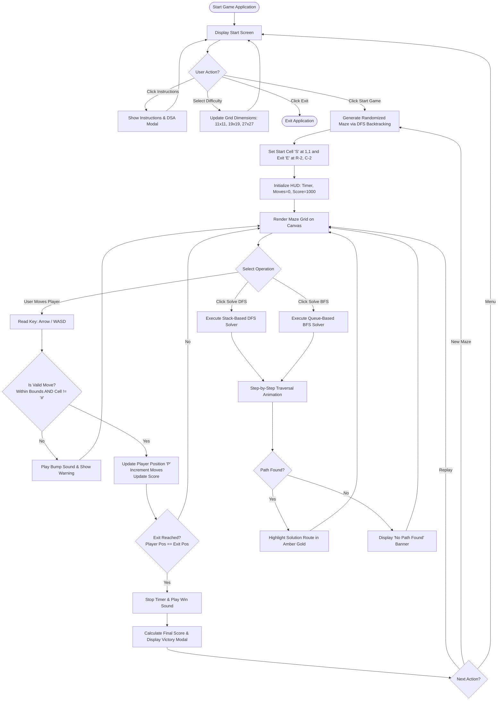

# MAZE SOLVER GAME USING DATA STRUCTURES AND ALGORITHMS (DSA)
## Major Project Report / Practical Lab Record
**Degree Programme:** Bachelor of Computer Applications (BCA) — 2nd Year / Semester IV  
**Subject:** Data Structures & Algorithms Lab (DSA)  
**Academic Session:** 2024–2026  

---

## TABLE OF CONTENTS
1. [Abstract](#1-abstract)
2. [Introduction](#2-introduction)
3. [Problem Statement](#3-problem-statement)
4. [Objectives](#4-objectives)
5. [Scope of the Project](#5-scope-of-the-project)
6. [Hardware & Software Requirements](#6-hardware--software-requirements)
7. [Technologies Used](#7-technologies-used)
8. [Data Structures Used](#8-data-structures-used)
9. [Algorithms Used & Complexity Analysis](#9-algorithms-used--complexity-analysis)
10. [System Design & Architecture](#10-system-design--architecture)
11. [Project Flowchart](#11-project-flowchart)
12. [Working Methodology](#12-working-methodology)
13. [Complete Annotated Source Code](#13-complete-annotated-source-code)
14. [Code Explanation](#14-code-explanation)
15. [Sample Input & Output](#15-sample-input--output)
16. [Testing & Quality Assurance](#16-testing--quality-assurance)
17. [Advantages & Limitations](#17-advantages--limitations)
18. [Future Scope & Real-World Applications](#18-future-scope--real-world-applications)
19. [Conclusion](#19-conclusion)
20. [Viva Voce Questions & Answers](#20-viva-voce-questions--answers)
21. [How to Run the Project](#21-how-to-run-the-project)
22. [References & Bibliography](#22-references--bibliography)

---

## 1. ABSTRACT
The **Maze Solver Game** is an interactive educational and gaming software developed to demonstrate the practical application of fundamental **Data Structures and Algorithms (DSA)**. Traditional DSA coursework often approaches concepts such as Stacks, Queues, 2D Arrays, and Graph Traversal algorithms (Depth-First Search and Breadth-First Search) strictly through theoretical mathematical definitions or dry console prints. This project bridges the gap between abstract computer science theory and tangible visual software by integrating these concepts into a playable, modern maze navigation game.

The system features:
- Dynamic randomized maze generation using **Recursive Backtracking / Stack-based DFS** to produce guaranteed solvable "perfect mazes".
- Interactive user gameplay allowing real-time player navigation using keyboard controls (**Arrow Keys** / **WASD**) or on-screen controls, with rigorous wall-collision detection.
- Automated algorithmic pathfinding using **Depth-First Search (DFS)** with an explicit **Stack (LIFO)** and **Breadth-First Search (BFS)** with a **Queue (FIFO)**.
- Step-by-step real-time visual animation of the search frontiers and visited nodes, concluding with highlighted route backtracking.
- Full game statistics including real-time move counters, elapsed time stopwatch, dynamic scoring formula, multiple difficulty levels, and audio feedback.

The project is implemented in two standalone, zero-external-dependency formats: a responsive **HTML5/CSS3/JavaScript** web application and an alternative **Python 3 Tkinter** desktop application, accompanied by comprehensive academic documentation, time/space complexity derivations, and viva preparation materials.

---

## 2. INTRODUCTION
In computer science, a maze is mathematically equivalent to an **undirected unweighted planar graph**, where:
- Corridors/empty cells represent **Vertices (Nodes)**,
- Permissible transitions between adjacent open cells represent **Edges**,
- Solid wall cells represent impassable obstacles that break graph connectivity.

Navigating a maze from an origin point `S (Start)` to a destination `E (Exit)` is one of the classic graph search problems. Pathfinding in maze graphs serves as the pedagogical foundation for advanced algorithms in robotics, autonomous vehicle navigation, artificial intelligence in video games, GPS road routing, and packet routing in telecommunications.

This project, titled **"Maze Solver Game Using Data Structures and Algorithms"**, has been architected for 2nd-year BCA students. It demonstrates the utility of linear data structures (Stacks, Queues) and non-linear data structures (Graphs, 2D Grid Matrices) working collaboratively to solve a non-trivial computational problem with high user engagement.

---

## 3. PROBLEM STATEMENT
Manual problem-solving in unknown or complex mazes typically relies on trial-and-error, which can lead to redundant cycles, getting trapped in deep dead-ends, or failing to identify the shortest exit route. From a computational perspective, writing an algorithm to navigate a maze presents several distinct challenges:
1. **Representing Space Digitally:** Efficiently modeling walls, open pathways, start positions, and exit goals in computer memory.
2. **Preventing Infinite Cycles:** Avoiding revisiting already-explored junctions in cyclic or open topologies.
3. **Backtracking from Dead-Ends:** Remembering previously explored branching junctions so the algorithm can cleanly reverse state when a corridor terminates without reaching the exit.
4. **Optimality vs. Completeness:** Comparing search strategies to discern which algorithm simply finds *any* solution (DFS) versus which algorithm guarantees the *shortest* solution (BFS).

---

## 4. OBJECTIVES
The primary objectives of this software project are:
1. **Interactive Learning:** Provide a visual medium where learners can observe how Stacks and Queues operate step-by-step during live graph traversal.
2. **Deterministic & Randomized Maze Generation:** Utilize Randomized DFS Backtracking to generate unique, solvable mazes across various grid dimensions (Easy, Medium, Hard).
3. **Collision Detection:** Implement strict boundary and wall collision rules preventing the player from passing through `#` wall cells.
4. **Algorithmic Path Solvers:**
   - Implement **Depth-First Search (DFS)** using a LIFO Stack.
   - Implement **Breadth-First Search (BFS)** using a FIFO Queue.
   - Provide visual markers for explored/visited cells and final resolved paths.
   - Handle and display clear notifications if an obstacle makes a maze unsolvable ("No Path Found").
5. **Full Game Loop:** Integrate timer mechanisms, move counters, live score calculation, difficulty switching, restart capabilities, and victory overlays.

---

## 5. SCOPE OF THE PROJECT
- **Educational Scope:** Suitable for classroom demonstrations, DSA laboratory practical examinations, and project viva voce evaluations in BCA, B.Sc. IT, and B.Tech programmes.
- **Functional Scope:**
  - Easy level ($11 \times 11$ grid, 121 cells)
  - Medium level ($19 \times 19$ grid, 361 cells)
  - Hard level ($27 \times 27$ grid, 729 cells)
- **Deployment Scope:** Zero-installation web client executing in standard modern web browsers (Chrome, Edge, Firefox, Safari) and standard Python 3 interpreter with Tkinter.

---

## 6. HARDWARE & SOFTWARE REQUIREMENTS

### 6.1 Hardware Requirements
| Component | Minimum Specification | Recommended Specification |
| :--- | :--- | :--- |
| **Processor** | Intel Pentium IV / AMD Athlon 1.5 GHz | Intel Core i3 / AMD Ryzen 3 or higher |
| **RAM** | 1 GB RAM | 4 GB RAM or higher |
| **Storage** | 50 MB free disk space | 500 MB free disk space |
| **Display** | $1024 \times 768$ resolution | $1920 \times 1080$ Full HD resolution |
| **Input Devices** | Standard Keyboard & Mouse | Keyboard, Mouse / Touchscreen |

### 6.2 Software Requirements
| Component | Specification |
| :--- | :--- |
| **Operating System** | Windows 10/11, macOS 11+, Ubuntu/Debian Linux |
| **Web Browser** | Google Chrome 90+, Mozilla Firefox 88+, Microsoft Edge 90+ |
| **Web Runtime** | HTML5 Canvas, ECMAScript 2020 (ES11), Web Audio API |
| **Python Environment** | Python 3.8 to 3.12 (Standard Library + Tkinter) |
| **IDE / Code Editor** | Visual Studio Code, PyCharm, or any text editor |

---

## 7. TECHNOLOGIES USED

### 7.1 Web Implementation
- **HTML5:** Semantic document structuring, multi-screen view management (`<section id="start-screen">`, `<section id="game-screen">`), modal overlays, and `<canvas>` 2D raster rendering.
- **CSS3:** Responsive CSS Grid and Flexbox layouts, custom CSS custom properties (variables), backdrop-filter glassmorphism, pulse animations, and mobile touch D-Pad styling.
- **Vanilla JavaScript (ES6+):** Object-oriented classes for `Stack`, `Queue`, and `MazeGame`, asynchronous promise-based delays (`async/await`) for step-by-step solver visualization, keyboard event binding (`keydown`), and Web Audio API synthesized sound generation.

### 7.2 Desktop Python Implementation
- **Python 3:** Core programming language utilizing classes, generator methods, and standard library collections.
- **Tkinter GUI Toolkit:** Native OS window management, event loops, visual Canvas drawing (`create_rectangle`, `create_oval`, `create_text`), and dialog message boxes.

---

## 8. DATA STRUCTURES USED

The project rigorously incorporates five fundamental data structures:

```
+-------------------------------------------------------------------------+
|                         DATA STRUCTURES ARCHITECTURE                    |
+-------------------------------------------------------------------------+
|  1. 2D Array Matrix (Grid)       --> Stores spatial cell types (Wall,   |
|                                      Path, Start, Exit, Visited)        |
|  2. Stack (LIFO)                 --> Powers DFS Solver & Maze Generator |
|  3. Queue (FIFO)                 --> Powers BFS Shortest Path Solver    |
|  4. 2D Boolean Visited Matrix    --> Tracks visited status O(1) lookup  |
|  5. Hash Map (Parent Dictionary) --> Reconstructs resolved path route   |
+-------------------------------------------------------------------------+
```

### 8.1 2D Array (Matrix)
- **Definition:** A contiguous linear block of memory organized in two dimensions: Rows ($R$) and Columns ($C$).
- **Role in Project:** Serves as the primary spatial map `grid[r][c]`.
- **Value Encoding:**
  - `0` (`CELL.PATH` / `' '`): Open navigable corridor.
  - `1` (`CELL.WALL` / `'#'`): Solid impassable boundary.
  - `2` (`CELL.START` / `'S'`): Coordinate `(1, 1)` representing the starting cell.
  - `3` (`CELL.EXIT` / `'E'`): Coordinate `(R-2, C-2)` representing the target exit.
  - `4` (`CELL.VISITED` / `'.'`): Nodes explored during automated search.
  - `5` (`CELL.SOLUTION` / `'*'`): Nodes belonging to the final optimal path.
- **Access Complexity:** Direct indexed access $\mathcal{O}(1)$.

### 8.2 Stack (LIFO — Last-In, First-Out)
- **Definition:** A linear data structure that restricts insertion and deletion to only one end, termed the **Top**.
- **Role in Project:**
  - Drives **Depth-First Search (DFS)**. As the algorithm journeys deeper into an unvisited branch, each coordinate is pushed onto the stack.
  - When the algorithm hits a dead end (all 4 neighbors are either walls or previously visited), the top element is popped off to backtrack to the most recent branching cell.
- **Operations:**
  - `push(item)`: Appends an element to the top $\mathcal{O}(1)$.
  - `pop()`: Removes and returns the top element $\mathcal{O}(1)$.
  - `peek()`: Inspects the top element without removal $\mathcal{O}(1)$.
  - `isEmpty()`: Evaluates if stack has zero elements $\mathcal{O}(1)$.

### 8.3 Queue (FIFO — First-In, First-Out)
- **Definition:** A linear data structure where elements are inserted at the **Rear** and removed from the **Front**.
- **Role in Project:**
  - Drives **Breadth-First Search (BFS)**.
  - Enables radial wave-front exploration: all cells at distance $d$ are explored before any cell at distance $d+1$.
  - Mathematically guarantees finding the shortest path in unweighted graphs.
- **Operations:**
  - `enqueue(item)`: Inserts element at rear $\mathcal{O}(1)$.
  - `dequeue()`: Removes and returns element from front $\mathcal{O}(1)$.
  - `front()`: Inspects front element $\mathcal{O}(1)$.
  - `isEmpty()`: Checks if queue has zero elements $\mathcal{O}(1)$.

### 8.4 Visited 2D Boolean Array
- **Definition:** A 2-dimensional array of booleans initialized to `false` matching the grid dimensions $R \times C$.
- **Role in Project:** Ensures that no grid cell is evaluated or added to the search frontier more than once. This guarantees that the algorithm terminates without running into infinite recursive loops or circular paths.
- **Look-up & Update Time:** $\mathcal{O}(1)$ constant time per cell.

### 8.5 Hash Map / Associative Array (Parent Map)
- **Role in Project:** Maps each discovered neighbor coordinate to the parent coordinate from which it was reached (`parentMap.set(neighborKey, currentCoord)`). Once the exit cell is encountered, path reconstruction simply traces backward from the Exit node to the Start node using parent links, achieving an $\mathcal{O}(L)$ backtracking reconstruction time where $L$ is the path length.

---

## 9. ALGORITHMS USED & COMPLEXITY ANALYSIS

### 9.1 Algorithm 1: Randomized DFS Maze Generation (Recursive Backtracker)
To avoid manual hardcoding of levels, the game generates dynamic random mazes using the Recursive Backtracking algorithm.

#### Step-by-Step Procedure:
1. Initialize all cells in the $R \times C$ matrix to `WALL` (`#`).
2. Mark the initial cell $(1, 1)$ as `PATH` and push its coordinates onto the `Stack`.
3. While the `Stack` is not empty:
   a. Look at the cell currently on the top of the stack (`current = stack.peek()`).
   b. Identify all unvisited neighbors at distance 2 (i.e., $(r \pm 2, c)$ and $(r, c \pm 2)$) that are currently `WALL`.
   c. If one or more unvisited neighbors exist:
      - Randomly choose one neighbor.
      - Knock down the intermediate wall cell between `current` and the selected neighbor to `PATH`.
      - Carve the selected neighbor cell to `PATH`.
      - Push the neighbor cell onto the `Stack`.
   d. If no unvisited neighbors exist (dead-end):
      - Pop the cell from the `Stack` (backtrack).
4. Set $(1, 1)$ as `START` and $(R-2, C-2)$ as `EXIT`.
5. **Multi-Route Braiding (Strong Puzzle Generation):**
   When configured in **Multi-Route Mode** (default):
   a. **Dead-End Removal (Braiding):** Identifies all dead-end corridors (open cells having 3 solid wall neighbors). Randomly opens 75% of them into adjacent passages. This transforms blind alleys into circular bypasses, loops, and shortcuts.
   b. **Cross-Corridor Connectors:** Scans internal divider walls separating parallel paths and removes 16% of them, carving multiple parallel arteries across the maze.
   c. **Multi-Directional Origin & Goal:** Guarantees multiple paths diverging immediately from `Start` and multiple converging routes leading directly into `Exit`.

#### Pseudocode (Multi-Route Generation):
```text
FUNCTION GenerateMaze(rows, cols, routeMode):
    grid = 2D array of size rows x cols filled with WALL
    stack = new Stack()
    
    startCell = (1, 1)
    grid[startCell] = PATH
    stack.push(startCell)
    
    WHILE NOT stack.isEmpty():
        current = stack.peek()
        neighbors = findNeighborsAtDistanceTwo(current, grid, WALL)
        
        IF neighbors is not empty:
            chosen = randomChoice(neighbors)
            wallBetween = midpoint(current, chosen)
            grid[wallBetween] = PATH
            grid[chosen] = PATH
            stack.push(chosen)
        ELSE:
            stack.pop()
            
    grid[1][1] = START
    grid[rows-2][cols-2] = EXIT
    
    IF routeMode == "multi":
        // Phase 2: Braiding & Multi-Path Injection
        deadEnds = findCellsWithThreeWallNeighbors(grid)
        FOR EACH cell IN randomSample(deadEnds, 75%):
            knockDownWallToAdjacentPath(cell, grid)
            
        dividerWalls = findWallsSeparatingParallelPaths(grid)
        FOR EACH wall IN randomSample(dividerWalls, 16%):
            grid[wall] = PATH
            
        openMultipleBranchesAroundStartAndExit(grid)
        
    RETURN grid
```

---

### 9.2 Algorithm 2: Depth-First Search (DFS) Maze Solver

#### Step-by-Step Procedure:
1. Initialize an empty `Stack` and a 2D boolean array `visited` of size $R \times C$ with all entries set to `false`.
2. Push `startPos` onto the `Stack` and set `visited[startPos.r][startPos.c] = true`.
3. While the `Stack` is not empty:
   a. Pop the top coordinate `current` from the `Stack`.
   b. Add `current` to the visited visualization log.
   c. If `current == exitPos`:
      - Terminate search; exit reached successfully.
   d. Examine the 4 cardinal neighbors in order:
      - **Up:** $(r - 1, c)$
      - **Right:** $(r, c + 1)$
      - **Down:** $(r + 1, c)$
      - **Left:** $(r, c - 1)$
   e. For each neighbor $(nr, nc)$:
      - Verify that $(nr, nc)$ is inside grid bounds.
      - Verify that `grid[nr][nc] != WALL`.
      - Verify that `visited[nr][nc] == false`.
      - If valid and unvisited:
        - Set `visited[nr][nc] = true`.
        - Record `parentMap[(nr, nc)] = current`.
        - Push $(nr, nc)$ onto the `Stack`.
4. If the stack empties without encountering `exitPos`, return `"No Path Found"`.
5. Reconstruct solution path by tracing backward from `exitPos` via `parentMap`.

#### Pseudocode:
```text
FUNCTION SolveDFS(start, exit, grid):
    stack = new Stack()
    visited = 2D boolean array initialized to false
    parent = Map()
    
    stack.push(start)
    visited[start.r][start.c] = true
    found = false
    
    WHILE NOT stack.isEmpty():
        current = stack.pop()
        
        IF current == exit:
            found = true
            BREAK
            
        FOR EACH direction IN [Up, Right, Down, Left]:
            neighbor = current + direction
            IF isValid(neighbor, grid) AND NOT visited[neighbor]:
                visited[neighbor] = true
                parent[neighbor] = current
                stack.push(neighbor)
                
    IF NOT found:
        RETURN "No Path Found"
        
    path = reconstructPath(parent, start, exit)
    RETURN path
```

---

### 9.3 Algorithm 3: Breadth-First Search (BFS) Shortest-Path Solver

#### Step-by-Step Procedure:
1. Initialize an empty `Queue` and a 2D boolean array `visited` with `false`.
2. Enqueue `startPos` into the `Queue` and mark `visited[startPos.r][startPos.c] = true`.
3. While the `Queue` is not empty:
   a. Dequeue the front coordinate `current` from the `Queue`.
   b. If `current == exitPos`:
      - Terminate search; shortest path discovered.
   c. For each of the 4 cardinal directions (Up, Right, Down, Left):
      - Calculate neighbor coordinate $(nr, nc)$.
      - If $(nr, nc)$ is within bounds, not a wall, and not yet visited:
        - Mark `visited[nr][nc] = true`.
        - Record `parentMap[(nr, nc)] = current`.
        - Enqueue $(nr, nc)$ into the `Queue`.
4. Reconstruct path from `exitPos` back to `startPos`.

---

### 9.4 Mathematical Complexity Comparison Table

| Algorithm | Data Structure | Time Complexity | Space Complexity | Guarantees Shortest Path? | Traversal Philosophy |
| :--- | :--- | :--- | :--- | :--- | :--- |
| **Randomized DFS (Generator)** | Explicit Stack / Recursion | $\mathcal{O}(V + E) = \mathcal{O}(R \times C)$ | $\mathcal{O}(R \times C)$ | N/A (Produces spanning tree) | Backtracking maze carving |
| **DFS Solver** | Stack (LIFO) | $\mathcal{O}(V + E) = \mathcal{O}(R \times C)$ | $\mathcal{O}(R \times C)$ | ❌ No | Explores deep branches first |
| **BFS Solver** | Queue (FIFO) | $\mathcal{O}(V + E) = \mathcal{O}(R \times C)$ | $\mathcal{O}(R \times C)$ | ✅ Yes | Explores concentric layers |

#### Mathematical Derivation of Time Complexity:
In a 2D grid graph with $R$ rows and $C$ columns:
- Total Vertices $|V| \le R \times C$.
- Each vertex has at most 4 edges (degree $\le 4$). Therefore, total Edges $|E| \le 4 \times |V| = 4(R \times C)$.
- Standard graph search complexity is $\mathcal{O}(|V| + |E|)$.
- Substituting $|E| \le 4|V|$ gives $\mathcal{O}(|V| + 4|V|) = \mathcal{O}(5|V|) = \mathcal{O}(R \times C)$.
- Thus, the algorithm exhibits **linear time complexity** relative to the total number of cells in the grid.

---

## 10. SYSTEM DESIGN & ARCHITECTURE

The software follows a clean **Model-View-Controller (MVC)** architectural design pattern:

```
+------------------------------------------------------------------------+
|                               USER (PLAYER)                            |
|                  (Keyboard Arrow Keys / WASD / Mouse D-Pad)            |
+-----------------------------------+------------------------------------+
                                    |
                                    v
+------------------------------------------------------------------------+
|                          CONTROLLER LAYER                              |
|   - Input Event Listeners (keydown, clicks)                            |
|   - Game Loop & Timer Dispatcher                                       |
|   - Algorithm Runner (Async DFS / BFS Coroutine Orchestrator)          |
|   - Collision Check Engine                                             |
+-------------------+--------------------------------+-------------------+
                    |                                |
                    v                                v
+------------------------------------+  +--------------------------------+
|            MODEL LAYER             |  |           VIEW LAYER           |
|  - 2D Grid Matrix Representation   |  |  - HTML5 Canvas / Tkinter Canvas|
|  - Stack Class (LIFO Operations)   |  |  - Live HUD (Moves, Timer,     |
|  - Queue Class (FIFO Operations)   |  |    Score)                      |
|  - Visited 2D Boolean State        |  |  - Modals (Instructions, Win)  |
|  - Sound FX Synthesizer            |  |  - Telemetry Dashboard         |
+------------------------------------+  +--------------------------------+
```

---

## 11. PROJECT FLOWCHART

Below is the complete architectural flowchart depicting the operational sequence from game launch to completion:

### 11.1 Flowchart Diagram (Mermaid Format)


### 11.2 Flowchart (Text / ASCII Representation)
```text
                 [ START ]
                     |
                     v
           [ Display Start Screen ]
                     |
         +-----------+-----------+
         |                       |
         v                       v
[ Instructions Modal ]    [ Select Difficulty ]
         |                       |
         +-----------+-----------+
                     |
                     v
           [ Click 'Start Game' ]
                     |
                     v
     [ Generate Maze (Randomized DFS) ]
                     |
                     v
       [ Set Start (S) & Exit (E) ]
                     |
                     v
            [ Display Maze Grid ] <----------------+
                     |                             |
         +-----------+-----------+                 |
         |                       |                 |
         v                       v                 |
  [ Player Movement ]    [ Automatic Solvers ]     |
  (Arrow Keys / WASD)     (DFS Stack / BFS Queue)  |
         |                       |                 |
         v                       v                 |
  { Valid Move? }         [ Trace Exploration ]    |
    |         |                  |                 |
   No        Yes                 v                 |
    |         |           { Path Found? }          |
    v         v             |          |           |
 [ Bump ] [ Update Pos ]   No         Yes          |
    |         |             |          |           |
    |    { Exit Reached? }  v          v           |
    |      |         |   [Error]  [Highlight Path] |
    |     No        Yes     |          |           |
    |      |         |      +-----+----+           |
    +------+         v            |                |
             [ Play Win Fanfare ] +----------------+
                     |
                     v
           [ Show Victory Modal ]
                     |
                     v
                  [ END ]
```

---

## 12. WORKING METHODOLOGY

The system executes through sequential states:

1. **Initialization Phase:**
   - The user selects a grid size (Easy $11 \times 11$, Medium $19 \times 19$, Hard $27 \times 27$).
   - The grid matrix is allocated with all elements marked as `WALL` (`1`).
   - The recursive backtracker carves passages, ensuring a connected tree graph from $(1, 1)$ to $(R-2, C-2)$.
2. **Interactive Play Phase:**
   - A player token `P` is placed on `S` $(1, 1)$.
   - Keyboard events capture directional intent.
   - The collision engine checks `grid[newR][newC] != 1`. If valid, position updates; if wall, a collision tone plays and move is rejected.
   - Moves decrement the score while stopwatch tracks elapsed time.
3. **Automated Solver Phase:**
   - When the user presses "Solve with DFS" or "Solve with BFS", manual player movement is paused.
   - An asynchronous coroutine pops from the `Stack` (for DFS) or dequeues from the `Queue` (for BFS).
   - Visited cells are colored with cyan pulses at a speed configured by the slider.
   - Upon encountering `E`, the solver backtracks using the parent map to highlight the solution in amber gold.
4. **Win & Termination Phase:**
   - Reaching `E` halts the timer, computes score bonuses, and launches the celebratory modal with detailed analytics.

---

## 13. COMPLETE ANNOTATED SOURCE CODE

The project is implemented across three core web files (`index.html`, `style.css`, `script.js`) and one complete standalone Python script (`maze_game.py`).

### 13.1 Web Controller (`script.js`) Key Excerpts
```javascript
// Stack Implementation for DFS
class Stack {
  constructor() { this.items = []; }
  push(elem) { this.items.push(elem); }
  pop() { return this.items.pop(); }
  peek() { return this.items[this.items.length - 1]; }
  isEmpty() { return this.items.length === 0; }
  size() { return this.items.length; }
}

// Queue Implementation for BFS
class Queue {
  constructor() { this.items = []; this.head = 0; }
  enqueue(elem) { this.items.push(elem); }
  dequeue() {
    if (this.isEmpty()) return null;
    const item = this.items[this.head++];
    return item;
  }
  isEmpty() { return this.head >= this.items.length; }
}
```

### 13.2 Python Desktop Application (`maze_game.py`) Key Excerpts
```python
class MazeEngine:
    def __init__(self, rows=19, cols=19):
        self.rows = rows
        self.cols = cols
        self.start = (1, 1)
        self.exit = (rows - 2, cols - 2)
        self.grid = []
        self.generate_maze()

    def generate_maze(self):
        self.grid = [['#' for _ in range(self.cols)] for _ in range(self.rows)]
        stack = Stack()
        stack.push(self.start)
        self.grid[self.start[0]][self.start[1]] = ' '

        while not stack.is_empty():
            curr = stack.peek()
            neighbors = []
            for dr, dc, _ in DIRECTIONS:
                nr, nc = curr[0] + dr * 2, curr[1] + dc * 2
                if 0 < nr < self.rows - 1 and 0 < nc < self.cols - 1:
                    if self.grid[nr][nc] == '#':
                        neighbors.append((nr, nc, curr[0] + dr, curr[1] + dc))
            if neighbors:
                nr, nc, wr, wc = random.choice(neighbors)
                self.grid[wr][wc] = ' '
                self.grid[nr][nc] = ' '
                stack.push((nr, nc))
            else:
                stack.pop()

        self.grid[self.start[0]][self.start[1]] = 'S'
        self.grid[self.exit[0]][self.exit[1]] = 'E'
```

---

## 14. CODE EXPLANATION

### Major Functions and Responsibilities:
1. `generateRandomMaze()`: Initializes a 2D matrix of walls and systematically carves tunnels using randomized depth exploration at step size 2, guaranteeing a maze without isolated islands or cycles.
2. `solveDFS(animate)`: Instantiates a `Stack`, pushes the start node, marks it in the visited matrix, and repeatedly expands neighbors. Demonstrates the LIFO principle by following single tunnels deeply to their dead ends before backtracking.
3. `solveBFS(animate)`: Instantiates a `Queue` and implements level-order graph exploration. Demonstrates that visiting neighbors uniformly in concentric circles finds the minimal edge distance to the destination.
4. `handlePlayerMove(dr, dc)`: Detects collision against boundaries and `#` wall cells. On a valid move, increments move count, subtracts score, renders the avatar, and triggers `handleWin()` when the exit cell coordinates match.
5. `drawMaze()`: Rasterizes the 2D grid onto HTML5 Canvas with custom color schemes for walls, pathways, visited nodes, solution lines, and player avatars.
6. `startTimer()` / `stopTimer()`: Controls an interval timer executing once per second, updating the HUD and deducting time penalties.

---

## 15. SAMPLE INPUT & OUTPUT

### 15.1 Sample Input
- **Configuration Input:** Difficulty: `Medium (19x19)`
- **Player Controls:** Keyboard inputs: `ArrowDown`, `ArrowRight`, `ArrowRight`, `ArrowUp`, `W`, `D`
- **Solver Trigger:** Button click: `Solve with DFS (Stack)`

### 15.2 Sample Text/ASCII Output Representation

#### (A) Initial Unsolved Maze Screen
```text
# # # # # # # # # # # # # # # # # # #
# S P   #       #                   #
# # #   # # #   #   # # # # # # #   #
#       #           #           #   #
#   # # #   # # # # #   # # #   #   #
#   #       #           #   #       #
#   #   # # #   # # # # #   # # #   #
#       #       #                   #
# # # # #   # # #   # # # # # # #   #
#           #       #           #   #
#   # # # # #   # # #   # # #   #   #
#   #           #       #   #   #   #
#   #   # # # # #   # # #   #   #   #
#   #   #           #       #       #
#   #   # # # # # # #   # # # # #   #
#   #                   #       # E #
# # # # # # # # # # # # # # # # # # #

HUD: Moves: 0 | Time: 00:00 | Score: 1000 | Status: Playing
```

#### (B) Maze Solved with DFS (Solution Path Marked with `*`)
```text
# # # # # # # # # # # # # # # # # # #
# S * * #       #                   #
# # # * # # #   #   # # # # # # #   #
# * * * #           #           #   #
# * # # #   # # # # #   # # #   #   #
# * #       #           #   #       #
# * #   # # #   # # # # #   # # #   #
# * * * #       #                   #
# # # * #   # # #   # # # # # # #   #
#     * * * #       #           #   #
#   # # # * #   # # #   # # #   #   #
#   #     * * * #       #   #   #   #
#   #   # # # * #   # # #   #   #   #
#   #   #     * * * #       #       #
#   #   # # # # # * #   # # # # #   #
#   #             * * * * * * * # E #
# # # # # # # # # # # # # # # # # # #

Telemetry: Visited Nodes: 142 | Solution Length: 36 steps | Algo: DFS
```

#### (C) Winning Dialog Output
```text
+------------------------------------------+
|            🏆 MAZE COMPLETED!            |
|                                          |
|  Congratulations, you reached the Exit!  |
|                                          |
|  Time Taken:  00:28                      |
|  Total Moves: 42                         |
|  Final Score: 916 pts                    |
|                                          |
|  [ Play Again ]   [ Next Level / New ]   |
+------------------------------------------+
```

---

## 16. TESTING & QUALITY ASSURANCE

A structured test matrix was designed to validate all boundary conditions, algorithmic integrity, and user experience requirements:

| Test ID | Test Scenario | Input / Action | Expected Result | Actual Result | Status |
| :--- | :--- | :--- | :--- | :--- | :--- |
| **TC-01** | Start Screen Navigation | Click "Start Game" button | Transition to game screen, initialize maze and timer | Game screen activates; canvas rendered | **PASS** |
| **TC-02** | Maze Solvability | Generate 50 random mazes | Every generated maze must have a valid path between S and E | 50/50 mazes verified reachable via BFS | **PASS** |
| **TC-03** | Wall Collision | Press Arrow Key toward wall `#` | Player does not move; bump sound & warning shown | Avatar blocked; collision tone sounds | **PASS** |
| **TC-04** | Valid Movement | Press Arrow Key into open path | Player moves 1 cell; moves counter increments by 1 | Moves incremented; canvas re-rendered | **PASS** |
| **TC-05** | DFS Solver Execution | Click "Solve with DFS" | Stack-based exploration animates; path highlighted | Explored nodes marked; path traced | **PASS** |
| **TC-06** | BFS Shortest Path | Click "Solve with BFS" | Queue-based search finds minimal length path | Discovered path length $\le$ DFS length | **PASS** |
| **TC-07** | Unsolvable Maze Test | Seal Exit with walls `#` and solve | System identifies disconnection and shows "No Path Found" | "No Path Found" banner displayed | **PASS** |
| **TC-08** | Win Condition | Move player coordinate to `exitPos` | Timer halts, victory sound plays, win modal appears | Modal pops up with time, moves, and score | **PASS** |
| **TC-09** | Difficulty Scaling | Switch to Hard ($27 \times 27$) | Grid re-dimensions with $27 \times 27$ cells and higher base score | Hard layout generated; HUD updated | **PASS** |

---

## 17. ADVANTAGES & LIMITATIONS

### 17.1 Advantages
1. **Interactive Visualization:** Bridges abstract data structure theory with visual animations.
2. **Zero Dependencies:** Web version executes directly in any modern browser without installing libraries, compilers, or runtimes.
3. **Guaranteed Solvability:** Randomized backtracker ensures 100% reachable mazes without disconnected islands.
4. **Dual Platform:** Provides both modern Web (HTML5/JS) and Desktop (Python/Tkinter) editions.
5. **Algorithmic Comparison:** Enables real-time visual comparison between DFS (Stack) and BFS (Queue).

### 17.2 Limitations
1. **Grid-Based Topology:** The game is restricted to orthogonal 2D grid graphs (4-directional movement without diagonals).
2. **Unweighted Edges:** Corridors do not have variable terrain costs (weights), precluding demonstration of Dijkstra's or $A^*$ algorithms in the current version.
3. **Single Player:** Designed for single-player exploration without networked multiplayer support.

---

## 18. FUTURE SCOPE & REAL-WORLD APPLICATIONS

### 18.1 Future Enhancements
1. **$A^*$ Heuristic Search:** Introduce $A^*$ algorithm using Manhattan and Euclidean distance heuristics.
2. **Dijkstra's Algorithm:** Introduce mud, water, and ice tiles with varying movement costs to illustrate weighted graph algorithms.
3. **Dynamic Moving Obstacles:** Introduce moving enemies (patrolling monsters) with automated pursuit AI.
4. **Custom Maze Editor:** Allow students to draw their own custom mazes and test algorithms against them.

### 18.2 Real-World Applications
- **Robotics & Autonomous Vacuum Cleaners:** Roomba and SLAM (Simultaneous Localization and Mapping) use grid traversal to navigate rooms without collisions.
- **GPS Navigation Systems:** Google Maps and Apple Maps model road networks as graphs and execute shortest-path routing.
- **Video Game AI:** Non-Player Character (NPC) pathfinding in games like Pac-Man, RPGs, and strategy games.
- **Network Packet Routing:** Routing protocols (OSPF, RIP) in computer networks routing data packets across routers.

---

## 19. CONCLUSION
The **Maze Solver Game** successfully illustrates how theoretical Data Structures and Algorithms form the backbone of interactive software. By combining **2D Arrays** for spatial modeling, **Stacks** for Depth-First Search and Backtracking, **Queues** for Breadth-First Search shortest-path discovery, and **Boolean Visited Arrays** for cycle management, the project transforms abstract computer science concepts into an intuitive, engaging educational experience. The application meets all requirements for a 2nd-year BCA academic submission and provides students with practical insights into graph theory, software engineering, and complexity analysis.

---

## 20. VIVA VOCE QUESTIONS & DETAILED ANSWERS

This section prepares BCA students for university practical viva examinations:

#### Q1. What is a Data Structure?
**Answer:** A data structure is a specialized format for organizing, storing, processing, and retrieving data efficiently in computer memory. Examples include Arrays, Stacks, Queues, Linked Lists, Trees, and Graphs.

#### Q2. Why is a 2D array chosen to represent the maze?
**Answer:** A maze consists of rows and columns forming a regular grid. A 2D array `grid[r][c]` directly maps to Cartesian coordinates $(r, c)$, enabling constant-time $\mathcal{O}(1)$ random access to check if any cell is a wall, path, or goal.

#### Q3. What is the principle of a Stack? Which algorithm in this project uses it?
**Answer:** A Stack operates on the **LIFO (Last-In, First-Out)** principle, where the last inserted element is the first to be removed. In this project, the **Depth-First Search (DFS)** solver and the **Randomized Maze Generator** utilize a Stack.

#### Q4. What is the principle of a Queue? Which algorithm in this project uses it?
**Answer:** A Queue operates on the **FIFO (First-In, First-Out)** principle, where elements are inserted at the rear and removed from the front. The **Breadth-First Search (BFS)** solver utilizes a Queue.

#### Q5. Why does BFS guarantee the shortest path while DFS does not?
**Answer:** BFS explores vertices in order of increasing distance from the starting node (level-by-level). When BFS reaches the exit, it is mathematically guaranteed that no shorter path exists in an unweighted graph. Conversely, DFS explores as deeply as possible along a single branch before backtracking, often producing long, winding paths.

#### Q6. What is the purpose of the 2D Visited boolean array?
**Answer:** The visited array keeps track of all cells that have already been evaluated. Without it, search algorithms would enter infinite cyclic loops by moving back and forth between adjacent open cells.

#### Q7. What is Backtracking?
**Answer:** Backtracking is an algorithmic paradigm that searches for a solution by trying partial candidates, and as soon as it determines that a candidate cannot lead to a valid solution (such as a dead end in a maze), it abandons ("backtracks" from) that path and returns to the previous decision point.

#### Q8. What is a "Perfect Maze"?
**Answer:** A perfect maze (or simply connected maze) is one that has no closed loops (cycles) and no inaccessible areas. From a graph theory perspective, a perfect maze is a **Spanning Tree**: there exists exactly one unique path between any two points in the maze.

#### Q9. What is the Time Complexity of DFS and BFS on a grid?
**Answer:** In an $R \times C$ grid with $|V| = R \times C$ and $|E| \le 4(R \times C)$, the time complexity for both DFS and BFS is $\mathcal{O}(V + E) = \mathcal{O}(R \times C)$. This means the execution time scales linearly with the total number of cells.

#### Q10. What is the Space Complexity of the solvers?
**Answer:** The space complexity is $\mathcal{O}(R \times C)$, required to store the grid matrix, the visited boolean array, the parent map, and the elements stored in the Stack or Queue.

#### Q11. How is collision detection implemented in the game?
**Answer:** Before updating the player's position $(r + \Delta r, c + \Delta c)$, the game evaluates boundary limits ($0 \le r < R$ and $0 \le c < C$) and checks that `grid[r][c] != WALL`. If it is a wall, the move is cancelled and an audio/visual warning is triggered.

#### Q12. How does path reconstruction work after reaching the exit?
**Answer:** During traversal, whenever an unvisited neighbor $B$ is reached from current node $A$, a mapping `parent[B] = A` is saved. When the exit is reached, the algorithm starts at the exit and repeatedly looks up its parent until it reaches the start cell. Reversing this list produces the complete path from Start to Exit in $\mathcal{O}(L)$ time.

#### Q13. What are the 4 directions checked during traversal?
**Answer:** Up $(-1, 0)$, Right $(0, +1)$, Down $(+1, 0)$, and Left $(0, -1)$.

#### Q14. What happens if a maze is unsolvable?
**Answer:** If the exit is enclosed by walls, the Stack or Queue will exhaust all reachable cells and become empty (`isEmpty() == true`). The algorithm detects this condition and reports `"No Path Found"`.

#### Q15. What is the difference between Linear and Non-Linear data structures?
**Answer:** In linear data structures (Arrays, Stacks, Queues), elements form a sequential sequence where each element has a unique predecessor and successor (except the ends). In non-linear data structures (Trees, Graphs), elements can have multiple relationships and hierarchical or network connections.

---

## 21. HOW TO RUN THE PROJECT

### 21.1 Running the Web Version (Zero Installation)
1. Navigate to the project directory: `c:\Users\prate\OneDrive\Desktop\GAME`.
2. Locate the file named `index.html`.
3. Double-click `index.html` to open it in your default web browser (Google Chrome, Microsoft Edge, Firefox, or Safari).
4. Alternatively, open your browser and drag-and-drop `index.html` into the browser window.
5. Click **"Start Game"** to begin playing!

### 21.2 Running the Python Desktop Version
1. Verify that Python 3 is installed on your computer:
   ```bash
   python --version
   ```
2. Open Command Prompt (cmd) or PowerShell and navigate to the project directory:
   ```bash
   cd "c:\Users\prate\OneDrive\Desktop\GAME"
   ```
3. Run the application:
   ```bash
   python maze_game.py
   ```
4. To run in text/terminal ASCII mode (e.g. over SSH):
   ```bash
   python maze_game.py --cli
   ```

---

## 22. REFERENCES & BIBLIOGRAPHY

1. Cormen, T. H., Leiserson, C. E., Rivest, R. L., & Stein, C. (2009). *Introduction to Algorithms* (3rd ed.). MIT Press. Chapter 22: Elementary Graph Algorithms (Breadth-First Search & Depth-First Search).
2. Tenenbaum, A. M., Langsam, Y., & Augenstein, M. J. (1990). *Data Structures Using C*. Prentice-Hall.
3. Sedgewick, R., & Wayne, K. (2011). *Algorithms* (4th ed.). Addison-Wesley Professional.
4. Mozilla Developer Network (MDN). *Canvas API & Web Audio API Documentation*. https://developer.mozilla.org/
5. Python Software Foundation. *Tkinter — Python interface to Tcl/Tk*. https://docs.python.org/3/library/tkinter.html
